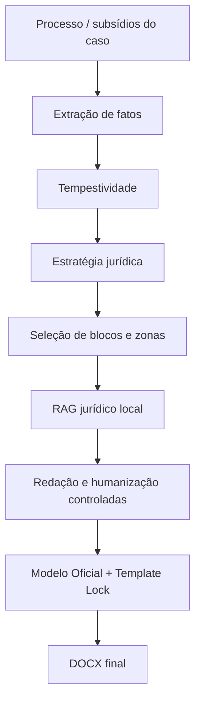

# EDE Legal


Sistema jurídico assistido por IA para geração estruturada de peças
processuais a partir de modelos institucionais, regras jurídicas, RAG
local e validações determinísticas. Distribuído como plugin para
[Claude](https://claude.com) — identificador técnico `ede-legal-plugin`.

> Atualmente, o módulo processual disponível é a Contestação.

Da análise processual ao DOCX final, preservando o Modelo Oficial e
validando deterministicamente a estrutura da peça.

O EDE Legal não é um gerador de texto genérico: raciocínio estratégico,
conteúdo institucional protegido, geração de conteúdo e validação
estrutural são etapas separadas, cada uma com sua própria responsabilidade
— e nenhuma delas substitui a revisão profissional do advogado responsável
antes do protocolo (ver [Aviso](#aviso)).

## O que o EDE Legal faz



O contexto institucional do Modelo Oficial é extraído antes de qualquer
outra etapa — nenhum conteúdo é redigido sem antes conhecer o texto fixo
já existente no template; o diagrama acima é uma simplificação didática
do fluxo real, não uma listagem exaustiva de estágios internos.

## Principais capacidades

### Modelo Oficial protegido
Texto institucional bloqueado; conteúdo variável só entra nas áreas
expressamente autorizadas (placeholders e Zonas de Complementação).

### Composição jurídica por blocos
Inclusão/exclusão controlada de preliminares, tópicos, subblocos e zonas
condicionais, a partir de decisão estratégica — nunca de heurística
embutida no motor documental.

### RAG jurídico local
Recuperação de fundamentos (busca lexical + vetorial) a partir da base
jurídica própria do projeto — CPC, Código Civil, CDC, Lei 8.987/1995,
Lei 9.427/1996 e REN ANEEL 1.000/2021.

### Template Lock
Validação determinística, parte a parte do pacote OOXML, que impede
alteração indevida do conteúdo institucional fora das áreas autorizadas.

### Runtime DOCX autônomo
Manipulação própria do pacote OOXML/ZIP — sem dependência de toolkit de
terceiro para gerar ou auditar o documento final.

### Fail-closed
Quando uma informação necessária é indeterminada ou o contrato documental
é inválido, o sistema interrompe a geração em vez de presumir.

### EDE Doctor
Diagnóstico reproduzível do ambiente (dependências, Modelo Oficial,
contrato do template) antes de qualquer geração.

## Arquitetura

```text
┌──────────────────────────────┐
│        Host / Adapter        │
│       Claude atualmente      │
└──────────────┬───────────────┘
               │
               ▼
┌──────────────────────────────┐
│          EDE Core            │
│ fatos · estratégia · RAG     │
│ blocos · validações          │
└──────────────┬───────────────┘
               │
               ▼
┌──────────────────────────────┐
│       Runtime DOCX EDE       │
│ OOXML · Template Lock        │
│ numeração · placeholders     │
└──────────────┬───────────────┘
               │
               ▼
          DOCX final
```

Claude é o host atualmente integrado ao EDE Legal. O núcleo (RAG,
validações, motor documental) foi estruturado para depender o mínimo
possível de mecanismos específicos do host — o que reduz o esforço de
uma eventual integração futura com outros hosts, mas **MCP e um adapter
OpenAI não estão implementados hoje**.

## Instalação

### Plugin

**Claude Code:**

```text
/plugin marketplace add lmgentil/ede-legal-plugin
/plugin install ede-legal-plugin@ede
```

**Claude Cowork** (pela interface, sem terminal). Este fluxo ainda **não foi
homologado de ponta a ponta**: marketplaces pessoais do Cowork podem
manter conteúdo anterior mesmo quando a interface exibe `synced` ou
`updated`. Esses estados não comprovam que a versão atual do plugin foi
carregada.

1. Customize → Plugins → Personal plugins → **+** → Add marketplace →
   Add from a repository → informe `lmgentil/ede-legal-plugin`.
2. Browse plugins → **EDE Legal Plugin** → Install.
3. Digite `/` no chat ou use o botão **+** — a Skill certa é acionada
   conforme o pedido.

**Clone pelo terminal** (estudo do código, desenvolvimento ou adaptação
nos limites da licença):

```bash
git clone https://github.com/lmgentil/ede-legal-plugin.git
```

### Dependências Python

```bash
pip install -r scripts/requirements.txt
pip install -r rag/requirements.txt
```

### Modelo Oficial

`modelo-oficial.docx` **não é distribuído pelo Git** — é um asset
institucional externo, fornecido separadamente pelo escritório. Instale:

```bash
python scripts/instalar_modelo_oficial.py CAMINHO_DO_ARQUIVO.docx
```

O script valida o pacote OOXML e o contrato institucional (placeholders/
blocos/zonas) antes de instalar — nunca substitui um modelo válido já
instalado por um arquivo que não passou na validação. Depois, confirme o
ambiente:

```bash
python scripts/ede_doctor.py
```

Só prossiga para a geração quando a saída terminar em:

```text
READY TO GENERATE
```

Procedimento completo, mensagens de erro e solução de problemas:
[`docs/DISTRIBUICAO.md`](./docs/DISTRIBUICAO.md).

## Primeiro uso

1. instalar o plugin (seção acima);
2. instalar o Modelo Oficial uma única vez por instalação;
3. confirmar `READY TO GENERATE` no EDE Doctor;
4. fornecer os documentos/subsídios do processo;
5. pedir a elaboração da Contestação em linguagem natural — por exemplo,
   "elabore uma contestação utilizando o EDE Legal" ou "analise os
   documentos desta pasta e elabore uma contestação";
6. revisar juridicamente o DOCX produzido antes de qualquer protocolo.

Não é necessário conhecer pytest, OOXML, Git ou a arquitetura interna do
runtime para este fluxo — esses tópicos são para quem desenvolve ou
mantém o plugin (ver [Documentação](#documentação)).

## Skills

**Skills de uso** — o advogado interage com elas diretamente:

| Skill | Função |
|---|---|
| `contestacao` | Orquestra a elaboração da Contestação — aciona as demais na ordem certa |
| `atualizar-ede` | `/updateEde` — verifica se há versão mais nova do plugin publicada |

**Skills de suporte/orquestração** — acionadas automaticamente pela
`contestacao`, nunca diretamente pelo usuário:

| Skill | Função |
|---|---|
| `estrategista-contestacao-ede` | Define a estratégia defensiva antes da redação |
| `redator-peca-processual-elite` | Realiza a redação jurídica estruturada |
| `humanizer-pt-br` | Refina a naturalidade e fluidez do texto |
| `calendario-forense-tjba-2026` | Calendário forense oficial do TJBA/2026 para tempestividade |

## Modelo Oficial e segurança documental

O Modelo Oficial (`modelo-oficial.docx`) é:

- **externo ao Git** — nunca commitado, nunca distribuído com o plugin;
- **institucional** — carrega a estrutura, o texto fixo e as cláusulas
  já definidas pelo escritório;
- **validado antes da instalação** — contrato de placeholders/blocos/
  zonas conferido antes de qualquer substituição (§ Instalação);
- **nunca substituído por um arquivo reprovado** — instalação atômica;
- **protegido pelo Template Lock** — qualquer alteração fora das áreas
  expressamente autorizadas (placeholders e Zonas de Complementação)
  reprova a geração.

Detalhes de formato (OOXML/ZIP) ficam em
[`docs/DISTRIBUICAO.md`](./docs/DISTRIBUICAO.md) — esta seção descreve só
o conceito.

## Qualidade e homologação

A v0.11.0 foi homologada sobre um **clone Git limpo** — não apenas no
ambiente do desenvolvedor — comprovando, entre outros pontos:

- instalação sem depender de nenhum toolkit DOCX de terceiro;
- bootstrap do Modelo Oficial (`instalar_modelo_oficial.py`);
- EDE Doctor reportando `NOT READY` antes e `READY TO GENERATE` depois
  do bootstrap;
- geração completa de uma Contestação até o DOCX final;
- Template Lock aprovado;
- zero placeholder residual;
- zero token/SDT estrutural residual;
- pacote DOCX (OOXML) válido;
- auditoria independente (`validate_template.py`) aprovada contra o
  mesmo DOCX gerado.

Metodologia completa e script de homologação:
[`docs/DISTRIBUICAO.md`](./docs/DISTRIBUICAO.md).

## Limitações atuais

- O Modelo Oficial precisa ser fornecido separadamente pelo escritório —
  não há download automático nem geração de um modelo genérico.
- A jurisprudência do escritório ainda não integra a busca híbrida do
  RAG jurídico — só legislação e regulamentação.
- A resolução do juízo/comarca depende do DataJud/CNJ estar disponível
  em produção — não há modo de geração sem essa etapa quando o
  placeholder correspondente é necessário.
- A inspeção visual automatizada do DOCX final ainda não está
  homologada (ver [Roadmap](#roadmap)).
- MCP e um adapter OpenAI ainda não estão implementados.
- O fluxo de instalação pelo Claude Cowork ainda não foi homologado de
  ponta a ponta (ver "Instalação").

## Roadmap

Direções gerais, sem promessa de prazo:

- expansão do banco de teses jurídicas;
- ampliação do Modelo Oficial para novos cenários;
- otimização de performance do RAG e da geração;
- camada de integração MCP;
- adapter OpenAI;
- inspeção visual automatizada do DOCX final.

## Documentação

| Assunto | Local |
|---|---|
| Distribuição e instalação detalhada | [`docs/DISTRIBUICAO.md`](./docs/DISTRIBUICAO.md) |
| Decisões de arquitetura (ADRs) | [`docs/adr/`](./docs/adr/) |
| Pendências técnicas conhecidas | [`docs/PENDENCIAS.md`](./docs/PENDENCIAS.md) |
| Histórico de versões | [`CHANGELOG.md`](./CHANGELOG.md) |
| Regras operacionais do projeto | [`CLAUDE.md`](./CLAUDE.md) |

## Princípios do projeto

- fail-closed: interromper diante de dúvida é preferível a presumir;
- conteúdo institucional é imutável fora das zonas expressamente
  autorizadas;
- uma única fonte canônica para cada contrato (versão, placeholders,
  catálogo de blocos);
- validação determinística sempre que a natureza do problema permitir;
- a IA redige dentro de limites explícitos — nunca decide sozinha o que
  é uma tese jurídica válida;
- o advogado mantém a revisão final antes de qualquer protocolo.

## Atualização

No Claude Code:

```text
/plugin marketplace update ede
/plugin update ede-legal-plugin@ede
```

`/updateEde` (Skill `atualizar-ede`) não executa os comandos acima — ela
só verifica se a versão instalada está desatualizada em relação à última
Release oficial publicada no GitHub e indica a Release correspondente.

No Claude Cowork, use `/updateEde` apenas para verificar a versão
carregada. Até a homologação completa desse fluxo, `synced` ou `updated`
não comprova atualização efetiva. Se houver divergência, reinstale por
um pacote/versionamento explicitamente identificado conforme o canal de
distribuição autorizado; não presuma que a sincronização visual resolveu
o cache.

## Desinstalação

```text
/plugin uninstall ede-legal-plugin@ede
```

## Desenvolvimento e testes

A suíte pytest é segmentada por dependência operacional. Os segmentos
pesados são mutuamente exclusivos; testes sem marcador pesado compõem o
grupo rápido.

```text
# Unitários e estruturais rápidos
python -m pytest -m "not rag and not docx_real and not pipeline_e2e and not network"

# Integração com o modelo institucional privado disponível localmente
python -m pytest -m docx_real

# RAG, artefatos persistidos e gold set
python -m pytest -m rag

# Pipeline Python completo da Contestação
python -m pytest -m pipeline_e2e

# Smoke tests externos — opt-in; retorna código 5 enquanto o segmento estiver vazio
python -m pytest -m network

# Gate final: todos os segmentos
python -m pytest
```

`pipeline_e2e` comprova o pipeline Python local, não uma execução real do
Claude Code. Os marcadores são registrados com `--strict-markers` em
`pytest.ini`, de modo que erros de digitação ou categorias não declaradas
interrompam a coleta.

## Solução de problemas

| Sintoma | O que fazer |
|---|---|
| Marketplace não encontrado | Confirme que adicionou `lmgentil/ede-legal-plugin` como marketplace antes de instalar o plugin. |
| Plugin não encontrado | O identificador técnico é `ede-legal-plugin`, dentro do marketplace `ede`. |
| Template institucional ausente | Esperado antes da instalação do arquivo — rode `python scripts/instalar_modelo_oficial.py CAMINHO_DO_ARQUIVO.docx` (ver "Instalação"); não é erro de instalação do plugin em si. |
| `ede_doctor.py` reporta `NOT READY` | Veja o item obrigatório indicado na saída e [`docs/DISTRIBUICAO.md`](./docs/DISTRIBUICAO.md) (seção "Solução de problemas") — causas comuns: Modelo Oficial ausente/desatualizado, dependência Python ausente. |
| Versão antiga carregada | No Claude Code, rode os comandos de atualização e reinicie/recarregue a sessão. No Cowork, confira com `/updateEde`; se persistir, reinstale por um pacote/versionamento explicitamente identificado, pois `synced` não comprova a versão carregada. |

## Segurança

> Não versione nem publique documentos processuais, credenciais,
> informações sigilosas ou outros dados de clientes junto ao repositório.

## Licença

O projeto utiliza licença própria **source-available** — não é open
source. Ver [`LICENSE`](./LICENSE) para o texto integral.

**Permitido:** visualizar, baixar/clonar, instalar, utilizar conforme os
termos da licença, estudar o código, uso profissional nos limites
definidos.

**Condicionado:** criar modificações e derivados, redistribuir
derivados — conforme os requisitos da licença.

**Proibido sem autorização prévia:** redistribuir o projeto original
como produto próprio, sublicenciar, vender ou oferecer comercialmente
cópia/derivado, remover avisos de autoria, apresentar o projeto como de
autoria própria, usar indevidamente marcas ou timbrados institucionais.

## Aviso

O EDE Legal é uma ferramenta de apoio à atividade jurídica e não
substitui a análise profissional do advogado responsável. O usuário deve
revisar fatos, fundamentos jurídicos, citações, tempestividade e
conteúdo final antes de qualquer protocolo ou utilização profissional.
